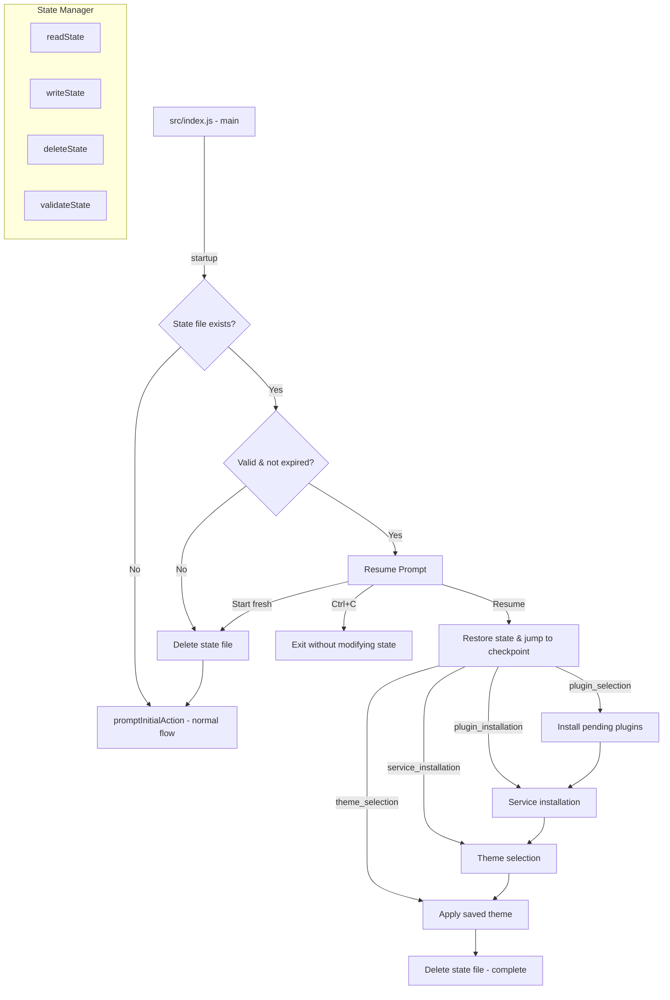

# Design Document: Resume Setup

## Overview

The Resume Setup feature adds checkpoint-based state persistence to the awesome-lazy-zsh CLI tool. A new `stateManager` module handles serializing setup progress to `~/.awesome-lazy-zsh-state.json` at each major step. On re-launch, the tool checks for an existing state file and, if a valid incomplete state is found, prompts the user to either resume from where they left off or start fresh.

The design minimizes changes to the existing flow by introducing a thin persistence layer that the current orchestration modules (`index.js`, `pluginManager.js`, `serviceInstallFlow.js`, `themeManager.js`) call into at well-defined checkpoints.

### Design Decisions

1. **Single flat JSON file** — Simple to read/write atomically, no external dependencies needed. The file lives in the user's home directory alongside `.oh-my-zsh`.
2. **Checkpoint-based (not step-by-step)** — State is saved at coarse-grained milestones rather than after every micro-action, keeping I/O minimal and the resume logic straightforward.
3. **24-hour staleness expiry** — Prevents stale resume prompts from confusing users days later.
4. **Schema version field** — Allows future migrations without breaking existing state files.
5. **Fail-safe deletion** — Any validation or schema mismatch results in deletion and fresh start, never a crash.

## Architecture



The `stateManager` module is a pure utility with no side effects beyond file I/O. All flow control decisions remain in `index.js` and the existing orchestration modules.

## Components and Interfaces

### 1. `src/utils/stateManager.js` (New Module)

```javascript
/**
 * @typedef {Object} SetupState
 * @property {number} version - Schema version (current: 1)
 * @property {string} checkpoint - Current checkpoint name
 * @property {string[]} selectedPlugins - User's plugin selections
 * @property {string[]} installedPlugins - Successfully installed plugins
 * @property {string[]} pendingPlugins - Plugins still to install
 * @property {string[]} selectedServices - Services user chose to install
 * @property {string[]} installedServices - Successfully installed services
 * @property {string[]} pendingServices - Services still to install
 * @property {string|null} selectedTheme - Chosen theme name
 * @property {number} timestamp - Unix timestamp (ms) of last update
 */

// Constants
export const STATE_FILE_PATH = path.join(os.homedir(), '.awesome-lazy-zsh-state.json');
export const CURRENT_SCHEMA_VERSION = 1;
export const MAX_AGE_MS = 24 * 60 * 60 * 1000; // 24 hours

// Public API
export function readState(): SetupState | null;
export function writeState(state: Partial<SetupState>): void;
export function deleteState(): void;
export function validateState(data: unknown): data is SetupState;
export function isExpired(state: SetupState): boolean;
```

| Function | Responsibility |
|----------|---------------|
| `readState` | Reads and parses the JSON file. Returns `null` if file doesn't exist or is unreadable. |
| `writeState` | Merges partial updates into existing state (or creates new), writes atomically, updates timestamp. |
| `deleteState` | Removes state file. Logs warning on failure, never throws. |
| `validateState` | Checks schema version, required fields, and correct types. |
| `isExpired` | Returns `true` if `timestamp` is older than 24 hours. |

### 2. `src/index.js` (Modified)

New logic at the top of `main()`:

```javascript
import { readState, deleteState, validateState, isExpired } from './utils/stateManager.js';

async function main() {
    // ... existing banner/separator ...
    
    // Resume detection
    const existingState = readState();
    if (existingState) {
        if (!validateState(existingState) || isExpired(existingState)) {
            deleteState();
            // Fall through to normal flow
        } else {
            const choice = await promptResume();
            if (choice === 'resume') {
                await resumeFromCheckpoint(existingState);
                return;
            } else if (choice === 'fresh') {
                deleteState();
                // Fall through to normal flow
            } else {
                // Ctrl+C — exit without touching state
                return;
            }
        }
    }
    
    // ... existing flow unchanged ...
}
```

### 3. `src/utils/pluginManager.js` (Modified)

After plugin selection, call `writeState` with checkpoint `plugin_selection`. During installation loop, update state after each successful plugin install.

### 4. `src/utils/serviceInstallFlow.js` (Modified)

After service selection, call `writeState` with checkpoint `service_installation`. During installation loop, update state after each successful service install.

### 5. `src/utils/themeManager.js` (Modified)

After theme selection (before applying), call `writeState` with checkpoint `theme_selection`.

### 6. Resume Prompt (in `src/prompts.js` or `src/index.js`)

```javascript
export async function promptResume() {
    const response = await prompts({
        type: 'select',
        name: 'action',
        message: 'A previous setup was interrupted. What would you like to do?',
        choices: [
            { title: 'Resume previous setup', value: 'resume' },
            { title: 'Start fresh', value: 'fresh' }
        ]
    });
    
    if (!response || response.action == null) return null; // Ctrl+C
    return response.action;
}
```

## Data Models

### State File Schema (`~/.awesome-lazy-zsh-state.json`)

```json
{
    "version": 1,
    "checkpoint": "plugin_selection",
    "selectedPlugins": ["git", "fzf", "zsh-autosuggestions"],
    "installedPlugins": ["git"],
    "pendingPlugins": ["fzf", "zsh-autosuggestions"],
    "selectedServices": [],
    "installedServices": [],
    "pendingServices": [],
    "selectedTheme": null,
    "timestamp": 1718900000000
}
```

### Checkpoint Progression

| Checkpoint | Meaning | Next Step on Resume |
|------------|---------|---------------------|
| `plugin_selection` | Plugins selected but not all installed | Install pending plugins → services → theme |
| `plugin_installation` | All plugins installed, services not started | Service installation → theme |
| `service_installation` | Services resolved | Theme selection |
| `theme_selection` | Theme chosen but not applied | Apply saved theme |

### Validation Rules

| Field | Type | Required | Constraint |
|-------|------|----------|------------|
| `version` | `number` | Yes | Must equal `CURRENT_SCHEMA_VERSION` |
| `checkpoint` | `string` | Yes | Must be one of the valid checkpoint names |
| `selectedPlugins` | `string[]` | Yes | Array of strings |
| `installedPlugins` | `string[]` | Yes | Array of strings |
| `pendingPlugins` | `string[]` | Yes | Array of strings |
| `selectedServices` | `string[]` | Yes | Array of strings |
| `installedServices` | `string[]` | Yes | Array of strings |
| `pendingServices` | `string[]` | Yes | Array of strings |
| `selectedTheme` | `string \| null` | Yes | String or null |
| `timestamp` | `number` | Yes | Positive integer (Unix ms) |


## Correctness Properties

*A property is a characteristic or behavior that should hold true across all valid executions of a system — essentially, a formal statement about what the system should do. Properties serve as the bridge between human-readable specifications and machine-verifiable correctness guarantees.*

### Property 1: State round-trip preservation

*For any* valid `SetupState` object, writing it with `writeState` and then reading it back with `readState` SHALL produce an object with identical field values for `checkpoint`, `selectedPlugins`, `installedPlugins`, `pendingPlugins`, `selectedServices`, `installedServices`, `pendingServices`, and `selectedTheme`.

**Validates: Requirements 1.1, 1.3, 1.4, 1.6**

### Property 2: Pending-to-installed transition preserves the selection set

*For any* state where a plugin (or service) exists in `pendingPlugins` (or `pendingServices`), moving that item to `installedPlugins` (or `installedServices`) SHALL result in a state where `installedPlugins.concat(pendingPlugins)` (or the service equivalent) contains exactly the same elements as `selectedPlugins` (or `selectedServices`).

**Validates: Requirements 1.2, 4.2, 4.3, 5.2, 5.3**

### Property 3: Validation rejects invalid state objects

*For any* object that is missing a required field, has a field with incorrect type, contains an unrecognized checkpoint value, or has a `version` not equal to `CURRENT_SCHEMA_VERSION`, `validateState` SHALL return `false`.

**Validates: Requirements 2.3, 8.1, 8.4**

### Property 4: Timestamp expiry boundary

*For any* timestamp value, `isExpired` SHALL return `true` if and only if `Date.now() - timestamp > MAX_AGE_MS` (24 hours in milliseconds).

**Validates: Requirements 9.2**

### Property 5: Checkpoint-to-step routing correctness

*For any* valid `SetupState` with a recognized checkpoint, the resume routing function SHALL map it to the correct next step: `plugin_selection` → install pending plugins, `plugin_installation` → service installation, `service_installation` → theme selection, `theme_selection` → apply saved theme.

**Validates: Requirements 3.2, 4.1, 5.1, 6.1, 6.2**

## Error Handling

| Scenario | Behavior | User Impact |
|----------|----------|-------------|
| State file unreadable (permissions) | `readState` returns `null` | Normal fresh flow, no disruption |
| State file contains malformed JSON | `readState` catches parse error, `deleteState`, proceed fresh | User sees fresh flow |
| State file missing required fields | `validateState` returns `false`, `deleteState`, proceed fresh | User sees fresh flow |
| State file has wrong schema version | `validateState` returns `false`, `deleteState`, proceed fresh | User sees fresh flow |
| State file is expired (>24h) | `isExpired` returns `true`, `deleteState`, proceed fresh | User sees fresh flow |
| `writeState` fails (disk full, permissions) | Catch error, log warning with `chalk.yellow`, continue flow without state persistence | Setup continues, just won't be resumable |
| `deleteState` fails (permissions) | Catch error, log warning with `chalk.yellow`, continue | User may see stale resume prompt next time |
| User cancels resume prompt (Ctrl+C) | `prompts` returns `undefined`, exit without touching state | State preserved for next attempt |
| Plugin install fails during resumed session | Plugin stays in `pendingPlugins`, flow continues with next plugin | User can resume again later |

### Graceful Degradation Principle

All state operations are wrapped in try/catch. Failures in state persistence never interrupt the primary setup flow. The worst case is that the user cannot resume — they can still complete setup normally.

## Testing Strategy

### Unit Tests (Node.js built-in test runner)

Focus on specific examples and edge cases:

- `readState` returns `null` when file doesn't exist
- `readState` returns `null` when file contains invalid JSON
- `deleteState` logs warning when file cannot be deleted
- `validateState` rejects object with missing `checkpoint` field
- `validateState` rejects object with non-array `selectedPlugins`
- `validateState` accepts a fully valid state object
- `isExpired` returns `true` for timestamp exactly 24h+1ms old
- `isExpired` returns `false` for timestamp exactly 24h-1ms old
- Resume routing with `plugin_selection` checkpoint skips selection
- Ctrl+C on resume prompt exits without state modification

### Property-Based Tests (fast-check)

The project already has `fast-check` as a devDependency. Each property test runs a minimum of 100 iterations.

| Property | Generator Strategy |
|----------|-------------------|
| Property 1 (Round-trip) | Generate random arrays of strings for plugin/service lists, random valid checkpoint names, random theme strings or null |
| Property 2 (Set invariant) | Generate random `selectedPlugins` arrays, split randomly into installed/pending, perform transition, verify union |
| Property 3 (Validation) | Generate random objects with controlled mutations (delete fields, change types, alter version, use invalid checkpoints) |
| Property 4 (Expiry) | Generate random timestamps spanning from very old to future, verify `isExpired` matches boundary condition |
| Property 5 (Routing) | Generate random valid states for each checkpoint, verify mapped step |

Each test file will include:
```javascript
// Feature: resume-setup, Property 1: State round-trip preservation
```

### Integration Tests

- Full flow: fresh install with state checkpoints → interrupt simulation → resume → completion → state file deleted
- Corrupted state file on disk → detection → deletion → fresh start

### Test File Structure

```
tests/
  stateManager.test.js          # Unit tests for stateManager module
  stateManager.property.test.js # Property-based tests  
  resumeFlow.test.js            # Integration tests for resume logic
```
