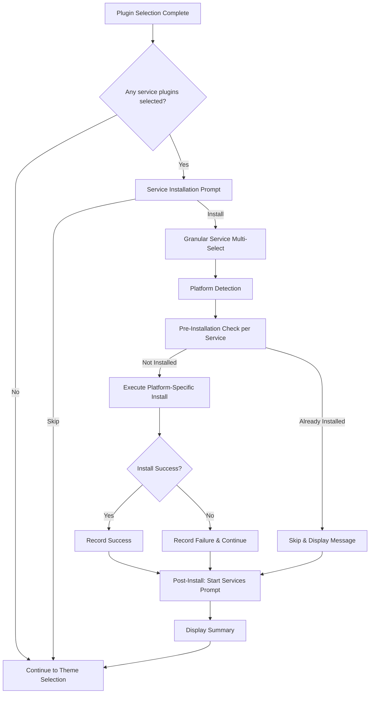
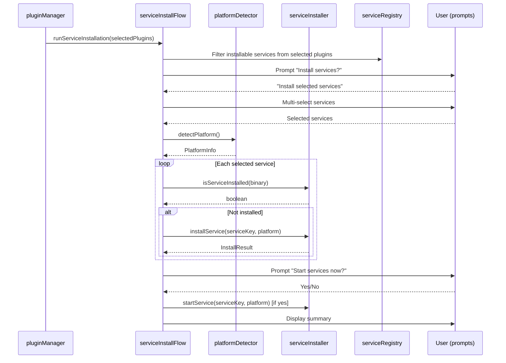

# Design Document: Service Installation

## Overview

This feature extends the awesome-lazy-zsh CLI to offer automatic installation of local development service servers when users select service-related alias plugins. Currently, selecting plugins like `mongodb`, `redis`, or `postgresql` only installs shell aliases for managing those services. With this feature, the CLI will detect which alias plugins correspond to installable services, prompt the user to install the actual server software, and handle the full installation lifecycle using platform-appropriate package managers.

The design follows the existing project architecture: a Node.js ES module CLI using `prompts` for interaction and `chalk` for output styling. The new functionality integrates into the existing plugin installation flow as a post-selection step, implemented primarily as an enhancement to `src/utils/serviceManager.js` with a new service registry configuration.

## Architecture

The feature introduces a layered architecture that plugs into the existing installation flow:



### Integration Point

The service installation step is triggered from `pluginManager.js` after plugins are selected and installed, but before theme selection. This keeps the existing flow intact and makes the new feature a composable addition.

### Key Design Decisions

1. **Post-plugin-selection trigger**: The prompt appears only after plugin selection completes, keeping the UX sequential and predictable.
2. **Registry-driven configuration**: All service metadata lives in a single registry object, making it trivial to add new services.
3. **Fail-forward strategy**: If one service fails to install, the installer continues with remaining services and reports a summary at the end.
4. **Binary detection for pre-checks**: Using `which`/`command -v` to check for service binaries is fast, cross-platform, and avoids false positives from partial installations.

## Components and Interfaces

### 1. Service Registry (`src/utils/serviceRegistry.js`)

A new module exporting the centralized service configuration.

```javascript
/**
 * @typedef {Object} ServiceConfig
 * @property {string} displayName - Human-readable service name
 * @property {number} port - Default service port
 * @property {string} binary - Binary name for detection (e.g., 'mongod')
 * @property {Object} brew - Homebrew config
 * @property {string} brew.package - Homebrew package name
 * @property {string|null} brew.tap - Required tap (null if none)
 * @property {Object} apt - apt config
 * @property {string|string[]} apt.packages - Package name(s) to install
 * @property {string|null} apt.repoSetup - Shell commands to add repository (null if none)
 * @property {Object} yum - yum config
 * @property {string|string[]} yum.packages - Package name(s) to install
 * @property {string|null} yum.repoSetup - Shell commands to add repository (null if none)
 * @property {string} systemdUnit - systemd service unit name (Linux)
 */

export const serviceRegistry = { /* ... */ };
```

### 2. Platform Detector (`src/utils/platformDetector.js`)

A new module responsible for detecting the OS and available package manager.

```javascript
/**
 * @typedef {Object} PlatformInfo
 * @property {'macos'|'linux'} os - Operating system
 * @property {'brew'|'apt'|'yum'|null} packageManager - Detected package manager
 * @property {string|null} error - Error message if no valid package manager found
 */

/**
 * Detects the platform and available package manager
 * @returns {Promise<PlatformInfo>}
 */
export async function detectPlatform() { /* ... */ }
```

### 3. Service Installer (`src/utils/serviceInstaller.js`)

The core installation logic, refactored from and replacing the install portion of the existing `serviceManager.js`.

```javascript
/**
 * @typedef {Object} InstallResult
 * @property {string} service - Service key
 * @property {boolean} success - Whether installation succeeded
 * @property {boolean} skipped - Whether service was already installed
 * @property {string} message - Status message
 */

/**
 * Checks if a service binary is already present
 * @param {string} binary - Binary name to check
 * @returns {Promise<boolean>}
 */
export async function isServiceInstalled(binary) { /* ... */ }

/**
 * Installs a single service using the detected platform's package manager
 * @param {string} serviceKey - Key from serviceRegistry
 * @param {PlatformInfo} platform - Detected platform info
 * @returns {Promise<InstallResult>}
 */
export async function installService(serviceKey, platform) { /* ... */ }

/**
 * Starts a service using platform-appropriate commands
 * @param {string} serviceKey - Key from serviceRegistry
 * @param {PlatformInfo} platform - Detected platform info
 * @returns {Promise<boolean>}
 */
export async function startService(serviceKey, platform) { /* ... */ }
```

### 4. Service Installation Flow (`src/utils/serviceInstallFlow.js`)

Orchestrates the user-facing prompts and coordinates the installation steps.

```javascript
/**
 * Main entry point for the service installation flow.
 * Called after plugin selection if service-related plugins were selected.
 * @param {string[]} selectedPlugins - List of selected plugin names
 * @returns {Promise<void>}
 */
export async function runServiceInstallation(selectedPlugins) { /* ... */ }
```

### 5. Integration with `pluginManager.js`

The existing `runFreshInstallation()` and `runDefaultInstallation()` functions will call `runServiceInstallation(installedPlugins)` after plugin installation succeeds.

### Component Interaction



## Data Models

### Service Registry Entry

```javascript
// Example entry in serviceRegistry
{
  mongodb: {
    displayName: 'MongoDB Community Server',
    port: 27017,
    binary: 'mongod',
    brew: {
      package: 'mongodb-community',
      tap: 'mongodb/brew'
    },
    apt: {
      packages: ['mongodb-org'],
      repoSetup: 'wget -qO... && echo "deb..." | sudo tee ...'
    },
    yum: {
      packages: ['mongodb-org'],
      repoSetup: 'cat <<EOF | sudo tee /etc/yum.repos.d/mongodb-org.repo...'
    },
    systemdUnit: 'mongod'
  }
}
```

### Installable Services Mapping

Maps alias plugin names to service registry keys:

```javascript
export const aliasToService = {
  'mongodb': 'mongodb',
  'mysql': 'mysql',
  'postgresql': 'postgresql',
  'redis': 'redis',
  'rabbitmq': 'rabbitmq',
  'elasticsearch': 'elasticsearch',
  'memcached': 'memcached'
};
```

### Install Result

```javascript
{
  service: 'mongodb',       // Service registry key
  success: true,            // Did installation succeed?
  skipped: false,           // Was it already installed?
  message: 'MongoDB Community Server installed successfully on port 27017.'
}
```

### Platform Info

```javascript
{
  os: 'macos',              // 'macos' | 'linux'
  packageManager: 'brew',   // 'brew' | 'apt' | 'yum' | null
  error: null               // Error message if packageManager is null
}
```


## Correctness Properties

*A property is a characteristic or behavior that should hold true across all valid executions of a system — essentially, a formal statement about what the system should do. Properties serve as the bridge between human-readable specifications and machine-verifiable correctness guarantees.*

### Property 1: Service filtering from plugin selection

*For any* list of selected plugins (drawn from the full `pluginRepos` keys), the set of installable services returned by `getInstallableServices(plugins)` SHALL equal exactly the intersection of the selected plugins with the keys of the `aliasToService` mapping. Consequently, the service installation prompt should trigger if and only if this intersection is non-empty.

**Validates: Requirements 1.1, 1.2, 2.1**

### Property 2: Install command generation correctness

*For any* service key in the service registry and *for any* valid platform (`{os:'macos', packageManager:'brew'}`, `{os:'linux', packageManager:'apt'}`, `{os:'linux', packageManager:'yum'}`), the generated install command sequence SHALL include the registry-configured tap/repo setup command (if non-null) followed by the platform-appropriate package install command using the correct package name(s) from the registry.

**Validates: Requirements 4.1, 4.2, 4.3, 4.4, 4.5, 4.6, 4.7, 5.1, 5.2, 5.3, 5.4, 5.5, 5.6, 5.7, 6.1, 6.2, 6.3, 6.4, 6.5, 6.6, 6.7**

### Property 3: Start command generation correctness

*For any* service key in the service registry and *for any* valid platform, the generated start command SHALL be `brew services start <brew.package>` on macOS, or `sudo systemctl start <systemdUnit>` followed by `sudo systemctl enable <systemdUnit>` on Linux.

**Validates: Requirements 8.2, 8.4, 8.5**

### Property 4: Service registry structural completeness

*For any* entry in the service registry, the entry SHALL contain all required fields: `displayName` (non-empty string), `port` (positive integer), `binary` (non-empty string), `brew.package` (non-empty string), `brew.tap` (string or null), `apt.packages` (non-empty array), `yum.packages` (non-empty array), and `systemdUnit` (non-empty string).

**Validates: Requirements 10.1, 7.3**

### Property 5: Installation summary completeness

*For any* list of `InstallResult` objects (containing service key, success, skipped, and message fields), the generated summary text SHALL mention every service's display name exactly once and correctly label each as installed, failed, or skipped.

**Validates: Requirements 9.4**

### Property 6: Success message format

*For any* service key in the service registry, when installation succeeds, the generated success message SHALL contain both the service's `displayName` and its `port` number.

**Validates: Requirements 9.2**

## Error Handling

### Package Manager Not Found

When platform detection fails to find a valid package manager (Homebrew missing on macOS, or both apt and yum missing on Linux):
- Display a clear error message identifying the expected package manager for the detected OS
- Skip the entire service installation flow gracefully
- Continue with the rest of the setup (theme selection, etc.)

### Individual Service Installation Failure

When a specific service fails to install (command returns non-zero exit code):
- Capture the error output
- Record the failure in the `InstallResult` with error details
- Display an error message with service name and error details
- **Continue installing remaining services** (fail-forward)
- Include the failed service in the final summary

### Service Already Installed

When the pre-check finds the binary already exists:
- Mark as `skipped: true` in the result
- Display an informational message (not an error)
- Proceed to next service

### Repository/Tap Setup Failure

When a tap (Homebrew) or repository addition (apt/yum) fails:
- Treat this as an installation failure for that service
- Do not attempt the install command since the package source is unavailable
- Report clearly that the repository setup failed

### Service Start Failure

When starting a successfully installed service fails:
- Display a warning (not a fatal error)
- Show the manual start command for the user to try
- Continue starting remaining services

### User Cancellation

If the user cancels any prompt (Ctrl+C or empty response):
- Exit the service installation flow gracefully
- Continue with the rest of setup (aliases are already installed)
- Do not treat cancellation as an error

## Testing Strategy

### Unit Tests

Unit tests cover specific behaviors and integration points:

- **Platform detection**: Mock `os.platform()` and `which`/`command -v` to test all platform/package-manager combinations
- **Pre-installation check**: Mock command execution to simulate binary present/absent scenarios
- **Prompt configuration**: Verify prompt objects have correct types, choices, and defaults
- **Error handling paths**: Verify fail-forward behavior when installations fail
- **Service registry validation**: Verify all 7 required services are present with correct keys

### Property-Based Tests

Property-based tests verify universal correctness properties using [fast-check](https://github.com/dubzzz/fast-check):

- **Library**: `fast-check` (mature JS property-based testing library)
- **Runner**: Node.js test runner (`node --test`) or vitest
- **Minimum iterations**: 100 per property test
- **Tag format**: `Feature: service-installation, Property {N}: {property_text}`

Each correctness property above maps to a single property-based test:
1. Generate random subsets of plugin names → verify filtering
2. Generate random service keys × platforms → verify install commands
3. Generate random service keys × platforms → verify start commands
4. Iterate all registry entries → verify structural completeness
5. Generate random lists of InstallResults → verify summary output
6. Iterate all registry entries → verify success message format

### Integration Tests

Integration tests verify the full flow with mocked shell commands:
- End-to-end flow: plugin selection → service prompt → install → start → summary
- Verify correct commands are passed to `runCommand()` in sequence
- Verify prompt flow when no services are selected (prompt skipped)
- Verify graceful handling when package manager is missing
