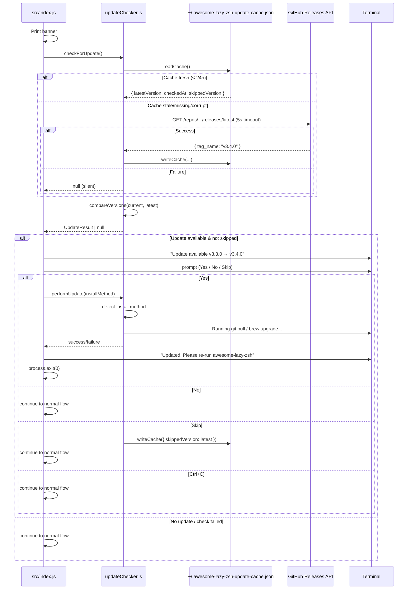

# Design Document: Update Notification

## Overview

The update notification feature adds a self-update system to the awesome-lazy-zsh CLI. On startup, it checks the GitHub Releases API for a newer version. If an update is available and hasn't been skipped, it presents an interactive prompt asking the user whether to update now. If accepted, it detects the installation method (git or Homebrew) and performs the update automatically.

The design follows the same graceful-degradation philosophy as `stateManager.js`: all network and file I/O is wrapped with silent failure. The user is never interrupted by errors from this subsystem.

### Design Decisions

1. **Interactive prompt over passive notice** — Users get an actionable choice rather than having to remember a manual command.
2. **Auto-detect install method** — Check for `.git` directory to determine git vs Homebrew. Simple and reliable.
3. **"Skip this version" option** — Prevents nagging. The skipped version is cached and won't prompt again until a newer version appears.
4. **No auto-restart** — After updating, we tell the user to re-run rather than exec-ing a new process. This avoids state corruption and is consistent with how `brew upgrade` works.
5. **5-second timeout** — The version check must complete within 5 seconds or is silently skipped.
6. **24-hour throttle** — Cache results to avoid hitting the API on every run.

## Architecture



### Startup Flow Integration

```mermaid
flowchart TD
    A[main() starts] --> B[Print banner]
    B --> C[checkForUpdate - await with 5s timeout]
    C --> D{Update available & not skipped?}
    D -- Yes --> E[Show update prompt]
    E --> F{User choice?}
    F -- Yes --> G[performUpdate]
    G --> H[Exit - ask user to re-run]
    F -- No --> I[Continue to normal flow]
    F -- Skip --> J[Cache skipped version]
    J --> I
    F -- Ctrl+C --> I
    D -- No --> I
    I --> K[ensureOhMyZshInstalled]
    K --> L[Resume detection]
    L --> M[Main menu]
```

## Components and Interfaces

### Module: `src/utils/updateChecker.js`

```javascript
/**
 * @typedef {Object} VersionCache
 * @property {string} latestVersion - Semver string (e.g., "3.4.0")
 * @property {string} checkedAt - ISO 8601 UTC timestamp
 * @property {string|null} skippedVersion - Version user chose to skip, or null
 */

/**
 * @typedef {Object} UpdateResult
 * @property {boolean} updateAvailable - True if latest > current
 * @property {boolean} skipped - True if this version was previously skipped
 * @property {string} currentVersion - Local version from package.json
 * @property {string} latestVersion - Version from GitHub or cache
 * @property {'git'|'brew'} installMethod - Detected installation method
 */

// --- Pure functions ---

export function parseVersion(version);
export function compareVersions(a, b);
export function isCacheFresh(cache);

// --- Cache I/O ---

export function readCache();
export function writeCache(cache);

// --- Core logic ---

export async function checkForUpdate();
export function detectInstallMethod();
export async function performUpdate(installMethod);
```

| Function | Responsibility |
|----------|---------------|
| `parseVersion` | Strips "v" prefix, parses major.minor.patch, handles pre-release |
| `compareVersions` | Returns 1, -1, 0, or null. Antisymmetric, reflexive |
| `isCacheFresh` | True if checkedAt < 24h ago and not in future |
| `readCache` | Reads + validates cache JSON, returns null on failure |
| `writeCache` | Atomic write via .tmp rename, fails silently |
| `checkForUpdate` | Orchestrates: cache → fetch → compare → return UpdateResult |
| `detectInstallMethod` | Checks for `.git` directory at project root |
| `performUpdate` | Runs `git pull` + `npm install` or `brew upgrade` |

### Integration: `src/index.js`

```javascript
import { checkForUpdate, performUpdate } from './utils/updateChecker.js';

async function main() {
    console.log(chalk.bold.blue('🚀 Starting Awesome-Lazy-Zsh setup...'));
    separator();

    // Update check (awaited, but with 5s timeout)
    const updateResult = await checkForUpdate();

    if (updateResult?.updateAvailable && !updateResult.skipped) {
        const choice = await promptUpdate(updateResult);
        if (choice === 'yes') {
            const success = await performUpdate(updateResult.installMethod);
            if (success) {
                console.log(chalk.green.bold('✅ Updated! Please re-run awesome-lazy-zsh.'));
                process.exit(0);
            }
            // If update failed, continue with current version
        } else if (choice === 'skip') {
            // Cache the skipped version
            writeCache({ ...readCache(), skippedVersion: updateResult.latestVersion });
        }
        // 'no' or Ctrl+C: fall through to normal flow
    }

    // ... existing startup flow ...
}
```

### Update Prompt (in `src/prompts.js`)

```javascript
export async function promptUpdate(updateResult) {
    const { currentVersion, latestVersion, installMethod } = updateResult;
    const method = installMethod === 'git' ? 'git pull' : 'brew upgrade';

    console.log(chalk.yellow(`\n⚡ Update available: v${currentVersion} → v${latestVersion} (via ${method})\n`));

    const response = await prompts({
        type: 'select',
        name: 'action',
        message: 'Would you like to update?',
        choices: [
            { title: 'Yes, update now', value: 'yes' },
            { title: 'No, continue with current version', value: 'no' },
            { title: 'Skip this version', value: 'skip' }
        ]
    });

    if (!response || response.action == null) return null; // Ctrl+C
    return response.action;
}
```

## Data Models

### Version Cache (`~/.awesome-lazy-zsh-update-cache.json`)

```json
{
  "latestVersion": "3.4.0",
  "checkedAt": "2026-07-22T14:30:00.000Z",
  "skippedVersion": null
}
```

| Field | Type | Required | Constraints |
|-------|------|----------|-------------|
| `latestVersion` | `string` | Yes | Valid semver, no `v` prefix |
| `checkedAt` | `string` | Yes | ISO 8601 UTC timestamp |
| `skippedVersion` | `string\|null` | No | Valid semver or null |

### Install Method Detection

| Condition | Result |
|-----------|--------|
| `.git/` exists at `path.join(SCRIPT_DIR, '.git')` | `'git'` |
| No `.git/` directory | `'brew'` |

Where `SCRIPT_DIR` is resolved from `import.meta.url` pointing to the package root.

## Correctness Properties

### Property 1: Version parsing round-trip

*For any* valid semver string, `parseVersion` returns an object whose segments reconstruct the original. *For any* invalid string, it returns `null`.

**Validates: Requirements 1.2, 1.5**

### Property 2: Cache round-trip preservation

*For any* valid `VersionCache` object, `writeCache` then `readCache` produces identical values.

**Validates: Requirements 1.3, 7.1**

### Property 3: Version comparison consistency

*For any* two valid semver strings, `compareVersions` is antisymmetric (`cmp(a,b) === -cmp(b,a)`) and reflexive (`cmp(a,a) === 0`).

**Validates: Requirements 2.1, 2.2, 2.3**

### Property 4: Invalid versions yield null

*For any* non-semver string, `compareVersions` returns `null`.

**Validates: Requirements 2.4**

### Property 5: Pre-release versions compare lower

*For any* version, appending a pre-release suffix makes it compare strictly lower.

**Validates: Requirements 2.5**

### Property 6: Cache freshness boundary

*For any* timestamp within 24h → fresh. Beyond 24h or in the future → stale.

**Validates: Requirements 7.2, 7.5**

### Property 7: Skipped version suppresses prompt

*For any* `UpdateResult` where `latestVersion` equals `skippedVersion`, the prompt is not shown.

**Validates: Requirements 7.6**

## Error Handling

| Scenario | Behavior | User Impact |
|----------|----------|-------------|
| Network timeout (>5s) | AbortController aborts; returns null | No prompt shown |
| Non-200 HTTP response | Caught; returns null | No prompt shown |
| Malformed JSON from API | Caught; returns null | No prompt shown |
| Invalid semver in tag_name | parseVersion returns null; returns null | No prompt shown |
| Cache unreadable/corrupt | Deleted; fresh fetch attempted | Transparent |
| git pull fails | Error displayed; continue to normal flow | User informed, not blocked |
| npm install fails | Warning displayed; continue to normal flow | User informed, not blocked |
| brew upgrade fails | Error displayed; continue to normal flow | User informed, not blocked |
| No network at all | Timeout; returns null | No prompt shown |
| User cancels prompt (Ctrl+C) | Returns null; continue to normal flow | Normal experience |

## Testing Strategy

### Property-Based Tests (fast-check)

| Property | Generator Strategy |
|----------|-------------------|
| 1: Parse round-trip | `fc.nat()` × 3 for valid; `fc.string()` for invalid |
| 2: Cache round-trip | `fc.record({ latestVersion, checkedAt, skippedVersion })` |
| 3: Comparison consistency | Random semver pairs |
| 4: Invalid → null | `fc.string()` filtered to non-semver |
| 5: Pre-release ordering | Valid version + random suffix |
| 6: Cache freshness | Random timestamps vs 24h boundary |
| 7: Skip suppression | Generate matching version pairs |

### Unit Tests

- `checkForUpdate` resolves null on HTTP 500
- `checkForUpdate` resolves null on timeout
- `detectInstallMethod` returns 'git' when .git exists
- `detectInstallMethod` returns 'brew' when .git missing
- `performUpdate` runs `git pull` + `npm install` for git method
- `performUpdate` runs `brew upgrade` for brew method
- Skipped version suppresses prompt
- Ctrl+C on prompt continues normal flow

### Test Files

```
tests/updateChecker.property.test.js  # Property-based tests
tests/updateChecker.test.js           # Unit tests
```
